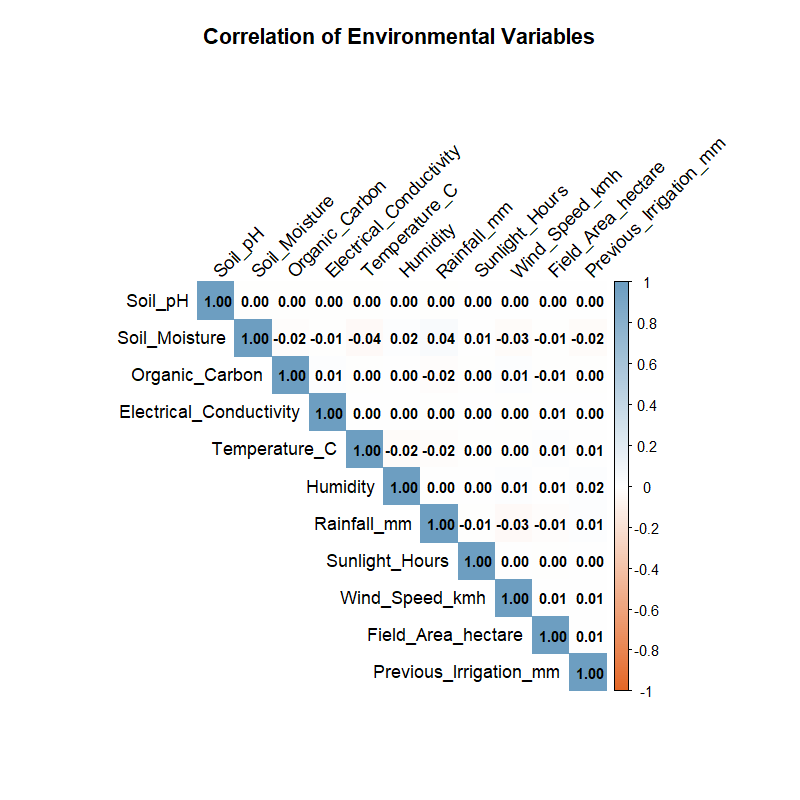
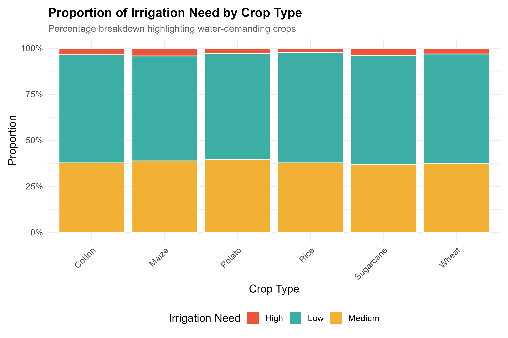
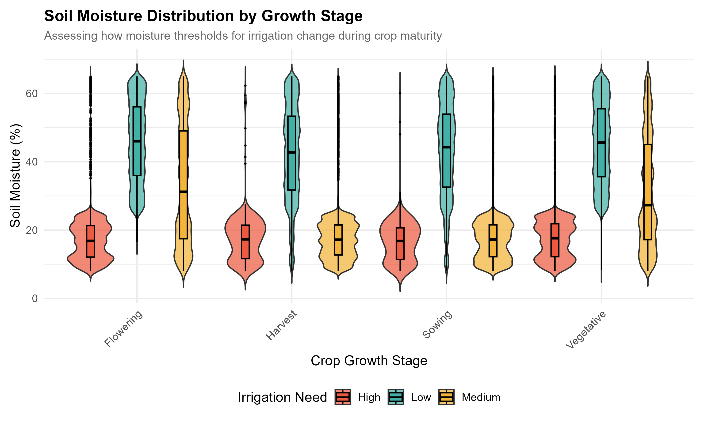
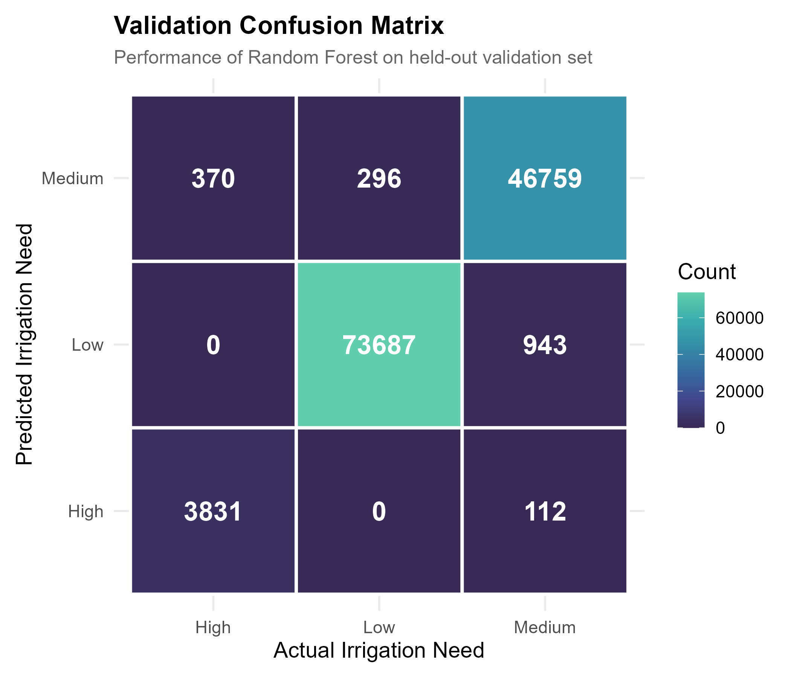
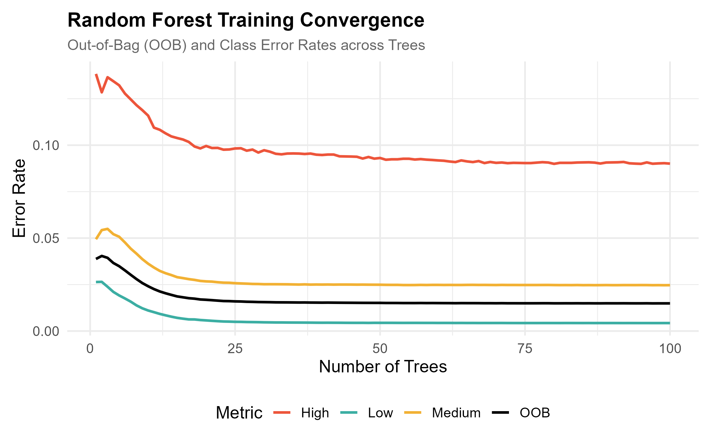
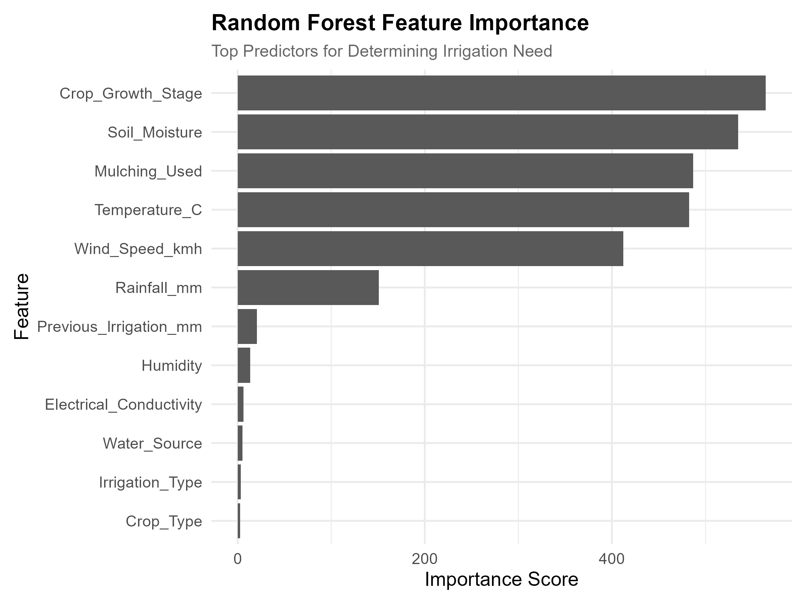
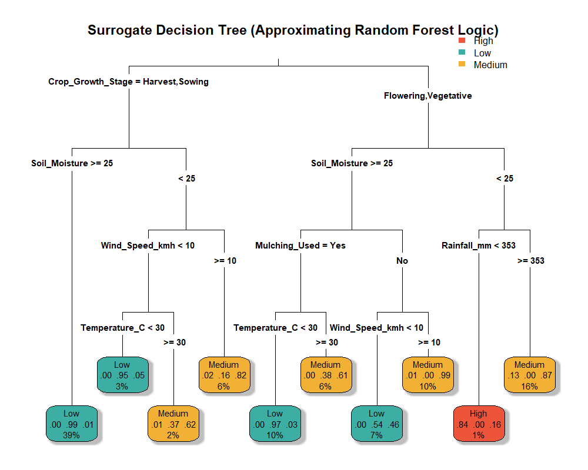
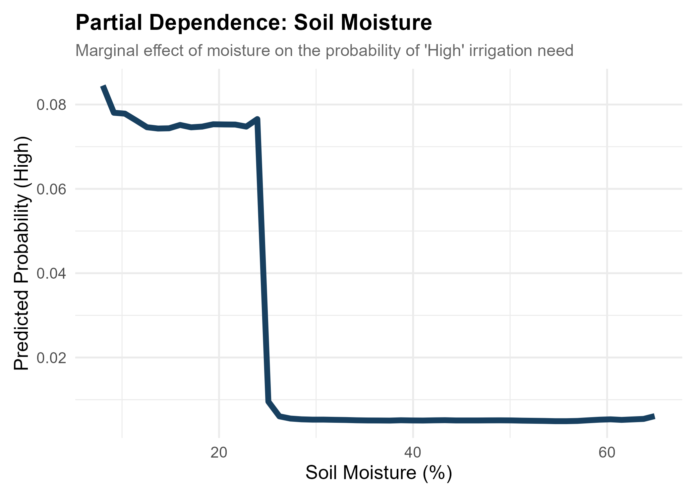
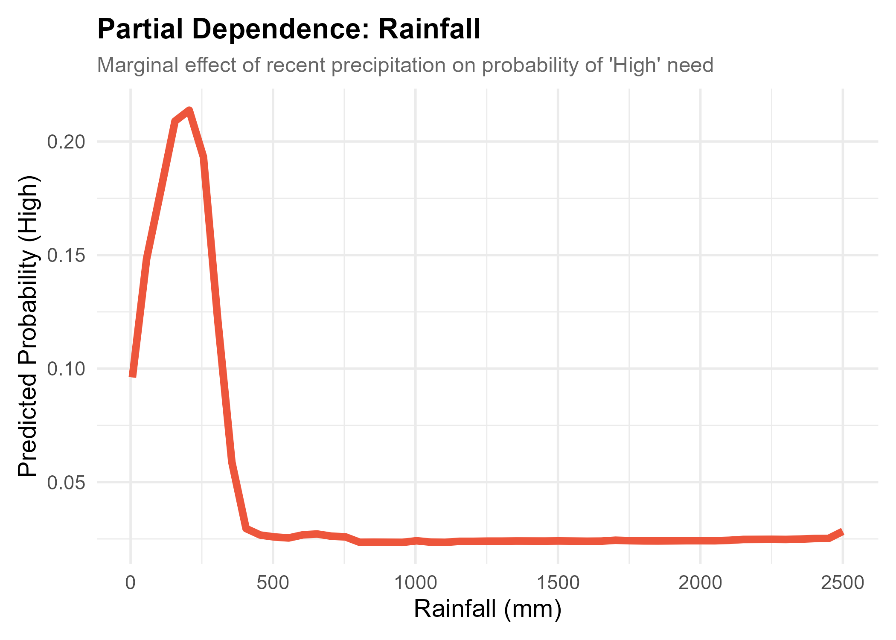
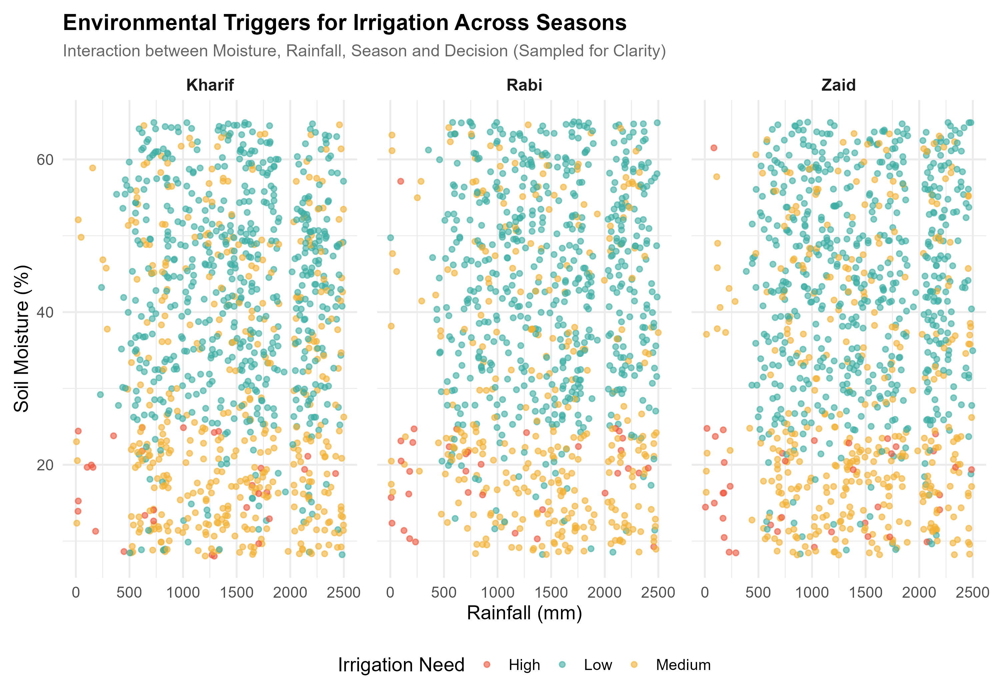

# 🌾 Irrigato - Irrigation Need Prediction

> **CSC 314 — Data Mining Final Project | Spring 2026**

A classification analysis project that predicts irrigation needs (**Low**, **Medium**, or **High**) for agricultural fields based on soil properties, crop characteristics, and environmental conditions. Built entirely in R using a Random Forest ensemble model.

---

## 📋 Table of Contents

- [Problem Statement](#-problem-statement)
- [Dataset](#-dataset)
- [Project Structure](#-project-structure)
- [Methodology](#-methodology)
  - [Data Preparation](#1-data-preparation)
  - [Exploratory Data Analysis](#2-exploratory-data-analysis)
  - [Model Training](#3-model-training--classification)
  - [Model Explainability](#4-model-explainability)
- [Results](#-results)
- [How to Run](#-how-to-run)
- [Dependencies](#-dependencies)

---

## 🧩 Problem Statement

Efficient water management is critical in modern agriculture. Over-irrigation wastes resources and degrades soil, while under-irrigation stunts crop growth and reduces yield. This project uses a data-driven approach to **classify the irrigation need level** of a field given its current environmental and soil conditions, enabling smarter water allocation decisions.

---

## 📊 Dataset

**Source:** [Kaggle — Playground Series S6E4](https://www.kaggle.com/competitions/playground-series-s6e4)

The dataset contains **628,000+ training records** and **270,000+ test records** across **20 features** describing environmental factors, soil characteristics, and crop metadata.

| Feature | Description |
|---|---|
| `Soil_Type` | Type of soil (e.g., Sandy, Clay, Loam) |
| `Soil_pH` | pH level of the soil |
| `Soil_Moisture` | Current moisture content (%) |
| `Organic_Carbon` | Organic carbon content in the soil |
| `Electrical_Conductivity` | Soil electrical conductivity |
| `Temperature_C` | Ambient temperature (°C) |
| `Humidity` | Relative humidity (%) |
| `Rainfall_mm` | Recent rainfall (mm) |
| `Sunlight_Hours` | Daily sunlight exposure (hours) |
| `Wind_Speed_kmh` | Wind speed (km/h) |
| `Crop_Type` | Type of crop planted |
| `Crop_Growth_Stage` | Current growth stage of the crop |
| `Season` | Current season |
| `Irrigation_Type` | Existing irrigation system type |
| `Water_Source` | Water source available |
| `Field_Area_hectare` | Field area (hectares) |
| `Mulching_Used` | Whether mulching is applied |
| `Previous_Irrigation_mm` | Volume of last irrigation event (mm) |
| `Region` | Geographic region |
| **`Irrigation_Need`** | **Target variable — Low, Medium, or High** |

- **No missing values** were found in the training set.
- All character columns were converted to factors for compatibility with Random Forest.

---

## 📁 Project Structure

```
Final_proj_Irrigation_Need/
├── analysis.R                  # Core pipeline: data loading, EDA, model training, inference
├── visualization.R             # Advanced visualizations & model explainability (extends analysis.R)
├── playground-series-s6e4/     # Raw dataset (train.csv, test.csv, sample_submission.csv)
├── analysis/                   # Outputs from analysis.R (basic EDA, variable importance, submission)
│   ├── eda_target_distribution.png
│   ├── eda_soil_moisture.png
│   ├── eda_rainfall.png
│   ├── model_variable_importance.png
│   └── final_submission.csv    # Predicted irrigation needs for the test set
├── visualization/              # Outputs from visualization.R (advanced charts, model exports)
│   ├── eda_numeric_correlation.png
│   ├── eda_crop_irrigation_prop.png
│   ├── eda_moisture_growth_violin.png
│   ├── exp_rf_error_convergence.png
│   ├── exp_feature_importance.png
│   ├── exp_surrogate_tree.png
│   ├── exp_pdp_soil_moisture.png
│   ├── exp_pdp_rainfall.png
│   ├── exp_confusion_matrix.png
│   ├── multi_season_facet.png
│   ├── rf_model.rds             # Serialized Random Forest model object
│   ├── rf_feature_importance.csv # Numerical importance scores
│   └── rf_tree_1_raw_splits.csv  # Raw split rules from Tree #1
├── README.md
└── LICENSE
```

---

## 🔬 Methodology

### 1. Data Preparation

- Loaded `train.csv` (~628K rows) and `test.csv` (~270K rows).
- Dropped the `id` column (non-predictive identifier).
- Converted all character columns to **factors** (required by the `randomForest` package).
- Verified **zero missing values** — no imputation needed.

### 2. Exploratory Data Analysis

Before building the model, we investigated the structure and relationships within the data through a series of advanced visualizations.

#### Correlation Heatmap
A correlation matrix of all numerical features reveals which environmental variables move together. For example, this helps identify whether temperature and sunlight hours are redundant, or whether rainfall and soil moisture are as correlated as one might assume.



#### Irrigation Need by Crop Type
Rather than just counting crops, this proportional stacked bar chart shows what **percentage** of each crop type falls into Low, Medium, or High irrigation need — instantly highlighting which crops are the most water-demanding.



#### Soil Moisture × Growth Stage Interaction
Violin plots layered with boxplots show how the distribution of soil moisture differs across crop growth stages, segmented by irrigation need. This reveals that the **threshold** at which irrigation becomes necessary shifts depending on how mature the crop is.



### 3. Model Training & Classification

- **Algorithm:** Random Forest (ensemble of 100 decision trees)
- **Split:** 80% training / 20% validation using stratified partitioning (`caret::createDataPartition`)
- **Reproducibility:** `set.seed(123)` used throughout

The model was trained on the 80% training split and evaluated on the held-out 20% validation set.

#### Confusion Matrix

The confusion matrix heatmap below shows the model's predictions vs. the actual labels on the validation set:



#### Performance Metrics

| Metric | High | Low | Medium |
|---|---|---|---|
| **Sensitivity** | 0.9119 | 0.9960 | 0.9779 |
| **Specificity** | 0.9991 | 0.9819 | 0.9915 |
| **Pos Pred Value** | 0.9716 | 0.9874 | 0.9860 |
| **Neg Pred Value** | 0.9970 | 0.9942 | 0.9866 |
| **Balanced Accuracy** | 0.9555 | 0.9889 | 0.9847 |

> **Overall Accuracy: 98.63%** with a Kappa of **0.9731**, indicating near-perfect agreement between predictions and actual labels.

The model performs exceptionally well across all three classes, with the "Low" class being the easiest to predict (99.6% sensitivity) and "High" being slightly harder due to its rarity (~3.3% prevalence).

### 4. Model Explainability

Understanding *why* the model makes its decisions is just as important as raw accuracy.

#### Error Convergence
This plot tracks the Out-of-Bag (OOB) error rate as trees are added to the forest. It demonstrates that the model converges and stabilizes well before 100 trees, confirming that our ensemble size is sufficient.



#### Feature Importance
The Variable Importance Plot (VIP) ranks every feature by how much it contributes to reducing classification error. The top predictors reveal what the model considers most critical when deciding irrigation need.



#### Surrogate Decision Tree
Since a Random Forest is an ensemble of 100 trees, it cannot be visualized as a single flowchart. Instead, we fit a **surrogate decision tree** (using `rpart`) to approximate the forest's logic. This provides a human-readable flowchart showing the primary split rules and thresholds the model relies on.



> The raw split rules for Tree #1 of the actual Random Forest are also exported to `visualization/rf_tree_1_raw_splits.csv` for detailed inspection.

#### Partial Dependence Plots

Partial Dependence Plots (PDPs) isolate the marginal effect of a single feature on the predicted probability, holding all other features constant. They answer questions like: *"At what exact soil moisture level does the model start predicting High irrigation need?"*

| Soil Moisture | Rainfall |
|---|---|
|  |  |

### 5. Multi-Dimensional Analysis

#### Seasonal Environmental Triggers
This faceted scatter plot visualizes the interaction between **Rainfall**, **Soil Moisture**, **Season**, and **Irrigation Need** simultaneously. Each panel represents a season, and points are colored by the irrigation decision — revealing how environmental baselines shift across seasons and how that affects water needs.



---

## 📈 Results

| Outcome | Value |
|---|---|
| **Model** | Random Forest (100 trees) |
| **Overall Accuracy** | 98.63% |
| **Kappa** | 0.9731 |
| **Top Predictors** | Soil Moisture, Rainfall, Temperature, Humidity |
| **Test Predictions** | Exported to `analysis/final_submission.csv` |
| **Serialized Model** | `visualization/rf_model.rds` (reloadable) |

### Key Insights

1. **Soil Moisture is the dominant predictor.** The PDP shows a steep probability cliff — once moisture drops below a certain threshold, the model strongly predicts High irrigation need.
2. **Rainfall has a clear inverse relationship** with irrigation need, but the effect plateaus at higher rainfall values, meaning additional rain beyond a threshold no longer significantly reduces irrigation demand.
3. **Crop growth stage matters.** The violin plots reveal that crops in later growth stages require different moisture baselines than early-stage crops, suggesting that irrigation schedules should adapt dynamically to crop maturity.
4. **The model generalizes extremely well** across all three classes, achieving >95% balanced accuracy even for the rare "High" class (only 3.3% of samples).

---

## 🚀 How to Run

### Prerequisites
- **R** (version 4.5+)
- Required packages are automatically installed by the scripts if missing.

### Step 1: Run the Core Analysis
Open R or RStudio and execute:
```r
source("analysis.R")
```
This will:
- Load and clean the dataset
- Generate initial EDA plots
- Train the Random Forest model
- Evaluate on the validation set
- Generate test predictions → `analysis/final_submission.csv`

### Step 2: Generate Advanced Visualizations
With the model still in memory, run:
```r
source("visualization.R")
```
This will:
- Detect the existing `rf_model` and `train_data` from Step 1 (no retraining!)
- Generate all advanced charts into the `visualization/` folder
- Export the serialized model, feature importance CSV, and confusion matrix heatmap

> **Note:** If `visualization.R` is run in a fresh R session, it will automatically `source("analysis.R")` first.

### Reloading the Model Later
```r
rf_model <- readRDS("visualization/rf_model.rds")
```

---

## 📦 Dependencies

| Package | Purpose |
|---|---|
| `tidyverse` | Data wrangling and ggplot2 visualization |
| `randomForest` | Random Forest classification model |
| `caret` | Data partitioning and confusion matrix |
| `corrplot` | Correlation heatmap |
| `pdp` | Partial Dependence Plots |
| `vip` | Variable Importance Plots |
| `ggcorrplot` | ggplot2-based correlation matrices |
| `scales` | Axis formatting (percentages) |
| `rpart` | Surrogate decision tree fitting |
| `rpart.plot` | Decision tree visualization |

---

## 📄 License

This project is licensed under the MIT License — see [LICENSE](LICENSE) for details.
